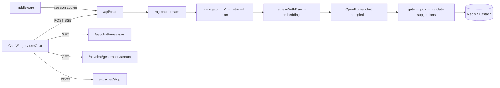

# AGENTS.md — Portfolio Guide

Instructions for AI agents (and humans) working on this repo.  
Read this first; Cursor loads `.cursor/rules/` for in-session enforcement.

---

## What this project is

Frederick Aurelio Halim's personal portfolio — bilingual (EN / 中文), GSAP-animated single-page site with an embedded **RAG chat widget** (OpenRouter LLM + vector retrieval over `docs/`).

| | |
|---|---|
| **Intl** | https://frederick-aurelio-halim.vercel.app/ |
| **China (VPS)** | http://120.26.45.50/ |
| **Stack** | Next.js 16, React 19, TypeScript, Tailwind 4, GSAP, TanStack Query, OpenRouter, Redis/Upstash |

Two subsystems share one Next.js app:

1. **Static portfolio** — scroll sections driven by `src/utils/data.ts`
2. **AI chat** — SSE streaming RAG pipeline in `src/lib/chat/` + `src/lib/knowledge/`

---

## Repo map

```
src/
  app/
    layout.tsx                 # metadata, JsonLd, font/lang init script, Providers
    page.tsx                   # Hero → About → Stack → Experience → Projects → Details → Footer
    opengraph-image.tsx        # OG image generation
    robots.ts, sitemap.ts, manifest.ts, viewport.ts
    api/chat/
      route.ts                 # POST — start RAG stream (maxDuration 180s; 60s on Vercel Hobby)
      messages/route.ts        # GET — paginated chat history
      stop/route.ts            # POST — abort in-flight generation
      generation/stream/route.ts  # GET — subscribe/resume active generation SSE
  components/
    sections/                  # Hero, About, TechStack, Experience, Projects, Details, Footer
    chat/                      # ChatWidget, ChatPanel, ChatResponsiveShell, message UI, suggestions
    ui/                        # drawer (vaul), popover (radix)
    Providers.tsx              # React Query + TextLanguage + ChatWidget (global)
    Navbar.tsx, Project.tsx, JsonLd.tsx, …
  context/
    TextContext.tsx            # language toggle (`en` | `ch`)
  hooks/
    useChat.ts                 # send, stream, stop, resume generation
    useChatMessages.ts         # paginated history (React Query)
    useChatOpenState.ts        # launcher open/close (desktop popover + mobile drawer)
    useLocalStorageState.ts, use-media-query.ts
  utils/
    data.ts                    # ★ all static UI copy + chat widget strings
  lib/
    site.ts                    # SEO constants, rootMetadata
    language.ts                # cookie + localStorage persistence
    fonts.ts                   # Noto Sans SC CDN (China vs global)
    gsap-client.ts
    chat/                      # SSE consume, generation lock/buffer, markdown, suggestion trailer
    chat-store/                # Redis or Upstash — messages, routing state, generation buffer
    knowledge/                 # RAG: navigator, retrieve, gate/pick suggestions, index.json
    openrouter/                # LLM + embedding client, stream transform
  middleware.ts                # chat session cookie (`CHAT_SESSION_COOKIE`)
docs/                          # ★ RAG source markdown
  about-me.md, work-experience.md, projects-overview.md
  nextjs-fxtrade.md, quizconnect.md, promis-conveyor-chain.md, memories.md
public/                        # images, icons, avatar, fonts
scripts/
  index-knowledge.ts           # embed docs → index.json + knowledge-map.json
  patch-chat-max-duration.mjs  # Vercel build: 180s → 60s on chat routes
docker-compose.yml             # VPS: app + Redis (China deployment)
docker-compose.dev-db.yml      # local Redis only
.env.example                   # all env vars documented
```

---

## Content sources

| Layer | Where | Used by |
|-------|--------|---------|
| **Static UI** | `src/utils/data.ts` | Section components, project cards, case studies |
| **Chat UI strings** | `data.ts` → `chat` export | ChatWidget labels, errors, placeholders |
| **Chat knowledge** | `docs/*.md` → `index.json` + `knowledge-map.json` | RAG retrieval + navigator |

Keep facts aligned across all three. After editing `docs/`, run `npm run index-knowledge`.

### `data.ts` exports

`hero` · `about` · `experience` · `projects` · `stacks` · `details` · `chat`

Types: `Language`, `LocalizedText`, `HeroContent`, `ProjectItem`, `DetailItem`, etc.

---

## Chat architecture



**Per-turn pipeline** (`createRagChatStream`):

1. **Routing** — `planRetrievalForTurn`: navigator LLM picks intent + search queries; fallback heuristics if navigator fails; `session-routing-state` tracks multi-turn focus
2. **Retrieving** — `retrieveWithPlan`: cosine similarity over precomputed embeddings in `index.json`
3. **Thinking + answer** — `buildRagMessages` + OpenRouter stream; optional reasoning block
4. **Suggestions** — `SuggestionTrailerFilter` parses `@@SUGGESTIONS@@` from answer content; valid trailer chips emit as parsed, otherwise `[]`

**Session & storage:**

- `middleware.ts` assigns httpOnly chat session cookie on first visit
- `CHAT_STORE_PROVIDER=redis` (VPS/Docker) or `upstash` (Vercel serverless)
- Generation lock + buffer allow subscribe/resume across reconnects (`generation/stream`)
- Message retention: sliding TTL (`CHAT_MESSAGE_TTL_SECONDS`, default 6h)

**Language:**

- Site language: cookie + localStorage via `TextContext` / `lib/language.ts`; SSR reads cookie in `layout.tsx`
- Chat replies: auto-detected from user message (`detectReplyLanguage` in `refusal.ts`)

---

## Cursor rules (`.cursor/rules/`)

| Rule file | When it applies |
|-----------|-----------------|
| `portfolio-context.mdc` | Always — project context and workflow |
| `portfolio-code.mdc` | Editing `src/**/*.{ts,tsx}` — patterns and conventions |

---

## How we work

1. **User describes the change** — content, section, chat/RAG fix, deployment, etc.
2. **Agent gathers facts before writing** — never invent job titles, dates, metrics, or project outcomes. Ask if facts are missing.
3. **Agent implements minimally** — match existing code style; small focused diffs.
4. **Don't commit or push** unless the user explicitly asks.

### Copy checklist (static UI + docs)

- [ ] First person: "I built…", not "Frederick is a passionate…"
- [ ] No AI-slop (leverage, seamless, robust, cutting-edge, passionate, Furthermore, "It is important to note")
- [ ] Sounds like a developer talking, not a resume template
- [ ] EN and 中文 share the same facts
- [ ] Links work; no fake stats

---

## Writing content

**Show what you built and why — not adjectives.**

| Section | Format |
|---------|--------|
| Hero | `I build [what] with [stack].` — plain, ~120 chars, no years in the hook |
| About | 2–4 short paragraphs, first person, one human detail |
| Project card | 1–2 sentences: who it's for, what it does, stack |
| Case study | Problem → decision/trade-off → result; uneven bullets |
| Experience | Role · Company · dates · 1–3 impact bullets each |
| Skills | Grouped categories, no % bars |

**Bilingual:** same facts in both languages. 中文: first person (我), no 官方腔, avoid 赋能/无缝体验/此外/综上所述.

**Chat docs (`docs/`):** factual notes Frederick would say in conversation. Tone rules live in `src/lib/knowledge/prompt.ts` — keep docs and prompt aligned.

---

## Code guidelines

### Static sections
1. Add types + data to `src/utils/data.ts`
2. Create or update `src/components/sections/YourSection.tsx`
3. Import in `src/app/page.tsx`
4. Add navbar entry in `hero[language].navbar` with matching section `id`

### Bilingual content
```ts
title: { en: "English text", ch: "中文文本" }
```
Access via `useLanguage()` → `content[language]` in client components.

### GSAP
- Import from `@/lib/gsap-client`
- Use `useGSAP` in section components

### Chat changes — where to look

| Task | Start here |
|------|------------|
| UI / UX | `src/components/chat/`, `data.ts` → `chat` |
| Send / stream / stop | `src/hooks/useChat.ts`, `src/lib/chat/consumeChatStream.ts` |
| RAG pipeline | `src/lib/chat/rag-chat-stream.ts` |
| Retrieval tuning | `src/lib/knowledge/plan-retrieval.ts`, `retrieve.ts`, `enrich-retrieval-plan.ts` |
| Suggestions | `suggestion-trailer.ts`, `suggestion-limits.ts`, `resolve-display-suggestions.ts` |
| Prompt / tone | `src/lib/knowledge/prompt.ts`, `build-messages.ts` |
| Storage / sessions | `src/lib/chat-store/`, `src/middleware.ts`, `src/lib/chat/session.ts` |
| API routes | `src/app/api/chat/` |

After logic changes: `npm run test`. After doc changes: `npm run index-knowledge`.

### Images
- Assets in `public/`; reference as `/filename.png` in data

---

## Environment variables

See `.env.example`. Key vars:

| Var | Purpose |
|-----|---------|
| `OPENROUTER_API_KEY` | Required for chat + indexing |
| `OPENROUTER_MODEL` | Chat model (default `deepseek/deepseek-v4-flash`) |
| `OPENROUTER_EMBEDDING_MODEL` | Embeddings (default `qwen/qwen3-embedding-8b`) |
| `RAG_TOP_K`, `RAG_MAX_CONTEXT_CHUNKS` | Retrieval tuning |
| `CHAT_STORE_PROVIDER` | `redis` (VPS) or `upstash` (Vercel) |
| `REDIS_URL` | Self-hosted Redis |
| `UPSTASH_REDIS_REST_URL/TOKEN` | Upstash on Vercel |
| `CHAT_MESSAGE_TTL_SECONDS` | Message retention (default 21600 = 6h) |
| `NEXT_PUBLIC_SITE_URL` | Canonical URL for SEO |
| `NEXT_PUBLIC_FONT_CDN` | `global` for Google Fonts CDN outside China |

Chat returns 503 when `OPENROUTER_API_KEY` is missing.

---

## Commands

```bash
npm install
npm run dev              # local dev
npm run build            # production build (VPS/Docker — 180s chat timeout)
npm run vercel-build     # Vercel: patches maxDuration to 60s, then build
npm run lint
npm run typecheck
npm run test             # chat + knowledge unit tests (*.test.ts)
npm run index-knowledge  # rebuild embeddings from docs/ (needs OPENROUTER_API_KEY)
```

**Local chat dev:** Redis via `docker compose -f docker-compose.dev-db.yml up -d`, set `REDIS_URL=redis://127.0.0.1:6379` in `.env.local`.

**VPS deploy:** `docker compose up --build` — uses bundled Redis, `CHAT_STORE_PROVIDER=redis`.

---

## What agents should NOT do

- Write case studies or chat docs from scratch without user-provided facts
- Invent metrics without confirmation
- Force-push, amend commits, or commit without being asked
- Refactor unrelated files during a focused task
- Use AI-slop phrases in user-facing copy
- Create extra markdown files unless user asks

---

## What agents SHOULD do

- Keep diffs small and focused
- Static copy → `data.ts`; chat facts → `docs/` (then re-index); chat labels → `data.ts` → `chat`
- Run `npm run test` after chat/knowledge logic changes
- Run `npm run build` after structural changes if reasonable

---

## Example prompts

- `"Update hero copy in data.ts — here's the new text: …"`
- `"Add bullets to docs/nextjs-fxtrade.md, then re-index"`
- `"Fix suggestion gating when user asks about two projects at once"`
- `"Chat drawer doesn't reopen on mobile after stop — check useChatOpenState"`
- `"Tune RAG_TOP_K — retrieval misses QuizConnect questions"`

---

*Last updated: July 2026*
