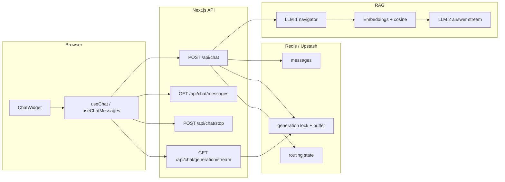

# Chat Flow — Frontend → Backend → Frontend (detailed)

This document walks through **exactly** what happens when a visitor uses the portfolio chat: from the floating button, through cookies, Redis locks, two LLMs, embeddings, SSE events, and back into the React UI — including refresh/resume and stop.

**How to open files:** every section has a markdown link like [`./src/middleware.ts`](./src/middleware.ts) — click that. Code blocks below each link show the relevant lines (also clickable in Cursor).

---

## Table of contents

1. [What you are looking at](#1-what-you-are-looking-at)
2. [Session cookie (before chat exists)](#2-session-cookie-before-chat-exists)
3. [UI mount tree](#3-ui-mount-tree)
4. [Loading history on open](#4-loading-history-on-open)
5. [Sending a message — frontend](#5-sending-a-message--frontend)
6. [POST /api/chat — server entry](#6-post-apichat--server-entry)
7. [RAG stream — the real pipeline](#7-rag-stream--the-real-pipeline)
8. [How SSE events become UI](#8-how-sse-events-become-ui)
9. [Suggestions trailer](#9-suggestions-trailer)
10. [Stop generation](#10-stop-generation)
11. [Refresh / resume](#11-refresh--resume)
12. [Storage, timeouts, errors](#12-storage-timeouts-errors)
13. [One-turn checklist](#13-one-turn-checklist)

---

## 1. What you are looking at

The site is one Next.js app with two jobs:

1. **Static portfolio** — Hero, About, Projects, etc. Copy lives in [`./src/utils/data.ts`](./src/utils/data.ts).
2. **AI chat widget** — always mounted globally. It talks to four API routes and a Redis/Upstash store.



**Design choice that drives a lot of the code:** refreshing the page must **not** cancel an in-flight answer. So the browser does **not** abort the generation with a normal `fetch` AbortController on unload. Stop is an explicit `POST /api/chat/stop`. Resume after refresh is a separate `GET` that polls a shared generation buffer.

---

## 2. Session cookie (before chat exists)

Every page load and every API call (except static assets) runs through middleware first.

**File:** [`./src/middleware.ts`](./src/middleware.ts)

```11:36:src/middleware.ts
export function middleware(request: NextRequest) {
  const existing = request.cookies.get(CHAT_SESSION_COOKIE)?.value;
  const sessionId = isValidSessionId(existing) ? existing : createSessionId();
  const isNewSession = !isValidSessionId(existing);

  const requestHeaders = new Headers(request.headers);
  requestHeaders.set(CHAT_SESSION_REQUEST_HEADER, sessionId);

  const response = NextResponse.next({
    request: { headers: requestHeaders },
  });

  if (isNewSession) {
    response.cookies.set({
      name: CHAT_SESSION_COOKIE,
      value: sessionId,
      httpOnly: true,
      secure: isSecureSessionRequest(request),
      sameSite: "lax",
      path: "/",
      maxAge: CHAT_SESSION_MAX_AGE_SECONDS,
    });
  }

  return response;
}
```

**What this means in plain language:**

- Cookie name: `portfolio-chat-session` (httpOnly — JavaScript cannot read it).
- Value: a UUID. That UUID is the **chat session id** for Redis keys (`chat:{sessionId}:…`).
- On the **first** visit, middleware creates a new UUID and sets the cookie (~400 days).
- It also copies the id into a request header (`x-portfolio-chat-session`) so the API handler for *this same request* can see the id even before the browser stores the cookie.
- `secure` follows `x-forwarded-proto` / URL protocol — plain HTTP VPS gets `secure: false`.

Matcher (not literally every request): skips `_next/static`, `_next/image`, favicon, and common image extensions — see `config.matcher` in the same file.

**File:** [`./src/lib/chat/session.ts`](./src/lib/chat/session.ts)

`requireSessionId` resolution order:

1. Request header `x-portfolio-chat-session` (middleware-injected)
2. Cookie `portfolio-chat-session` on the request
3. Fallback: `cookies()` from Next (same cookie name)

Invalid / missing → throws `SessionError` → API returns **401**.

Same-origin `fetch` from the chat widget sends the cookie automatically. The client never puts the session id in JSON bodies.

---

## 3. UI mount tree

### 3.1 Where the widget comes from

The root layout wraps the page in `Providers`. Providers create React Query and mount `ChatWidget` next to the page content — so the chat FAB exists on every route.

**File:** [`./src/components/Providers.tsx`](./src/components/Providers.tsx)

```25:35:src/components/Providers.tsx
export function Providers({ children, initialLanguage }: ProvidersProps) {
  const [queryClient] = useState(makeQueryClient);

  return (
    <QueryClientProvider client={queryClient}>
      <TextLanguage initialLanguage={initialLanguage}>
        {children}
        <ChatWidget />
      </TextLanguage>
    </QueryClientProvider>
  );
}
```

### 3.2 ChatWidget is the orchestrator

`ChatWidget` does not call `fetch` itself. It wires three hooks and passes props into the shell:

**File:** [`./src/components/chat/ChatWidget.tsx`](./src/components/chat/ChatWidget.tsx)

```15:50:src/components/chat/ChatWidget.tsx
export default function ChatWidget() {
  const { language } = useLanguage();
  const { open, ready, toggle, close, handleDesktopOpenChange, handleMobileOpenChange } =
    useChatOpenState();

  const errorMessages = useMemo(
    () => ({
      notConfigured: chat.chatErrorNotConfigured[language],
      storageUnavailable: chat.chatErrorStorage[language],
      unauthorized: chat.chatErrorUnauthorized[language],
      generic: chat.chatErrorGeneric[language],
      generating: chat.chatErrorGenerating[language],
      vercelTimeout: chat.chatErrorVercelTimeout[language],
    }),
    [language],
  );

  const {
    storedPages,
    isLoadingHistory,
    // ...
  } = useChatMessages();

  const {
    optimisticMessages,
    isLoading,
    sendMessage,
    resumeGeneration,
    abort,
  } = useChat(errorMessages);
```

| Hook | File | Job |
|------|------|-----|
| `useChatOpenState` | [`./src/hooks/useChatOpenState.ts`](./src/hooks/useChatOpenState.ts) | Open/close FAB; persist preference in localStorage. No network. |
| `useChatMessages` | [`./src/hooks/useChatMessages.ts`](./src/hooks/useChatMessages.ts) | Infinite query → `GET /api/chat/messages`. |
| `useChat` | [`./src/hooks/useChat.ts`](./src/hooks/useChat.ts) | Send, resume, abort; owns optimistic messages + stream status. |

Then it **merges** server history with optimistic in-flight messages for display:

**File:** [`./src/components/chat/ChatWidget.tsx`](./src/components/chat/ChatWidget.tsx)

```99:105:src/components/chat/ChatWidget.tsx
  const messages = useMemo(() => {
    const merged = mergeMessagesById(storedPages, optimisticMessages);
    return merged.map((message) => ({
      ...message,
      reasoningExpanded: isReasoningExpanded(message, expandedReasoningIds),
    }));
  }, [storedPages, optimisticMessages, expandedReasoningIds]);
```

**Why merge?** While a turn is streaming, the assistant text lives in React state (`optimisticMessages`) so the UI updates every frame. After `done`, that turn is written into the React Query cache and optimistic state is cleared. Merge means you never flash an empty list during that handoff.

### 3.3 Shell → panel → input

**Files:**
- [`./src/components/chat/ChatResponsiveShell.tsx`](./src/components/chat/ChatResponsiveShell.tsx)
- [`./src/components/chat/ChatPanel.tsx`](./src/components/chat/ChatPanel.tsx)
- [`./src/components/chat/ChatHeader.tsx`](./src/components/chat/ChatHeader.tsx)
- [`./src/components/chat/ChatMessageList.tsx`](./src/components/chat/ChatMessageList.tsx)
- [`./src/components/chat/ChatMessageBubble.tsx`](./src/components/chat/ChatMessageBubble.tsx)
- [`./src/components/chat/ChatSuggestions.tsx`](./src/components/chat/ChatSuggestions.tsx)
- [`./src/components/chat/ChatInput.tsx`](./src/components/chat/ChatInput.tsx)
- [`./src/hooks/useChatOpenState.ts`](./src/hooks/useChatOpenState.ts)
- [`./src/lib/chat/storage.ts`](./src/lib/chat/storage.ts)

```
ChatResponsiveShell
  desktop: Radix Popover + ChatPanel
  mobile:  vaul Drawer + ChatPanel
ChatPanel
  ChatHeader
  ChatMessageList → ChatMessageBubble (markdown, reasoning, phase labels)
  ChatSuggestions (chips)
  ChatInput (send / stop)
  ChatRetentionNotice
```

- Desktop vs mobile: media query `min-width: 768px` in [`./src/components/chat/ChatResponsiveShell.tsx`](./src/components/chat/ChatResponsiveShell.tsx).
- While `isLoading`, the input’s primary action becomes **Stop** and calls `onAbort` (not send).
- Suggestion chips call `onSend` with the chip text — same path as typing.

Until open-state hydration finishes (`ready`), the widget renders `null` so you do not flash the wrong open/closed state.

---

## 4. Loading history on open

### 4.1 Frontend

**Files:**
- [`./src/hooks/useChatMessages.ts`](./src/hooks/useChatMessages.ts)
- [`./src/lib/chat/fetch-messages.ts`](./src/lib/chat/fetch-messages.ts)

`useChatMessages` runs a React Query infinite query. First page:

```
GET /api/chat/messages?limit=10
```

Older messages (scroll up):

```
GET /api/chat/messages?limit=10&before=<createdAt of oldest message on page>
```

### 4.2 Backend

**File:** [`./src/app/api/chat/messages/route.ts`](./src/app/api/chat/messages/route.ts)

```14:43:src/app/api/chat/messages/route.ts
export async function GET(request: NextRequest) {
  try {
    const sessionId = await requireSessionId(request);
    const { searchParams } = new URL(request.url);
    const limit = Math.min(
      Math.max(Number.parseInt(searchParams.get("limit") ?? String(DEFAULT_LIMIT), 10) || DEFAULT_LIMIT, 1),
      MAX_LIMIT,
    );
    const beforeRaw = searchParams.get("before");
    const before = beforeRaw ? Number.parseInt(beforeRaw, 10) : null;
    const isLatestPage = before === null || !Number.isFinite(before);

    const store = await prepareChatStore();

    const result =
      before !== null && Number.isFinite(before)
        ? await store.getMessagesBefore(sessionId, before, limit)
        : await store.getLatestMessages(sessionId, limit);

    const withGenerating = await injectGeneratingAssistant(
      sessionId,
      store,
      result,
      isLatestPage,
    );

    return finalizeChatJsonResponse(
      NextResponse.json(withGenerating),
      request,
    );
```

Backend details that matter when debugging history:

- `limit` is clamped to **1–50** (default 10).
- `prepareChatStore()` ([`./src/lib/chat-store/api.ts`](./src/lib/chat-store/api.ts)) hydrates the Upstash read-your-writes sync token from header/cookie **before** any Redis/Upstash read — otherwise a serverless instance can miss the user message just written by another instance.
- Store shape ([`./src/lib/chat-store/keys.ts`](./src/lib/chat-store/keys.ts)): ZSET `chat:{sid}:timeline` (score = `createdAt`) + JSON at `chat:{sid}:msg:{id}`. `before` is an exclusive upper bound on that score. Response: `{ messages, nextCursor, retentionSeconds }` — `nextCursor` is the oldest `createdAt` on the page when more exist.
- `finalizeChatJsonResponse` may set the Upstash sync cookie on the JSON response (section 12).

**Important detail — generating inject:** if a generation is still running (lock held + buffer exists), the latest page **pretends** the in-flight assistant is already in history:

**File:** [`./src/lib/chat/inject-generating-message.ts`](./src/lib/chat/inject-generating-message.ts)

```4:36:src/lib/chat/inject-generating-message.ts
export async function injectGeneratingAssistant(
  sessionId: string,
  store: ChatStore,
  result: PaginatedMessages,
  isLatestPage: boolean,
): Promise<PaginatedMessages> {
  if (!isLatestPage) return result;

  const locked = await store.isGenerationLocked(sessionId);
  if (!locked) return result;

  const buffer = await store.getGenerationBuffer(sessionId);
  if (!buffer) return result;

  if (result.messages.some((message) => message.id === buffer.assistantMessageId)) {
    return result;
  }

  const generatingMessage = {
    id: buffer.assistantMessageId,
    role: "assistant" as const,
    content: buffer.content,
    reasoning: buffer.reasoning || undefined,
    createdAt: buffer.updatedAt,
    status: "generating" as const,
    streamPhase: buffer.streamPhase,
  };

  return {
    ...result,
    messages: [generatingMessage, ...result.messages],
  };
}
```

On the client, [`./src/lib/chat/merge-messages.ts`](./src/lib/chat/merge-messages.ts) (`mergeMessagesById`) maps `status: "generating"` → UI `status: "streaming"`. That is what triggers auto-resume (section 11).

Response also includes `retentionSeconds` (default 6 hours) for the retention notice under the input.

---

## 5. Sending a message — frontend

### 5.1 User presses Enter

**Files:**
- [`./src/components/chat/ChatInput.tsx`](./src/components/chat/ChatInput.tsx) — Enter / send button
- [`./src/hooks/useChat.ts`](./src/hooks/useChat.ts) — `sendMessage`

Flow: `ChatInput` → `onSend(text)` → `useChat.sendMessage`.

### 5.2 Guards and optimistic UI

**File:** [`./src/hooks/useChat.ts`](./src/hooks/useChat.ts)

```266:301:src/hooks/useChat.ts
  const sendMessage = useCallback(
    async (text: string) => {
      const trimmed = text.trim();
      if (!trimmed || status !== "idle") return;

      if (hasStoredGeneratingAssistant(queryClient)) {
        setOptimisticMessages((prev) => [
          ...prev,
          {
            id: randomId(),
            role: "error" as const,
            content: errorMessages.generating,
            status: "error" as const,
            createdAt: Date.now(),
          },
        ]);
        return;
      }

      const tempUserId = randomId();
      const tempAssistantId = randomId();

      const userMessage: ChatMessage = {
        ...createMessage("user", trimmed),
        id: tempUserId,
      };
      const assistantPlaceholder: ChatMessage = {
        id: tempAssistantId,
        role: "assistant",
        content: "",
        status: "streaming",
        createdAt: Date.now(),
      };

      setOptimisticMessages((prev) => [...prev, userMessage, assistantPlaceholder]);
      setStatus("submitting");
```

**What the user sees immediately:** their message + an empty assistant bubble (phase will flip to routing/retrieving/thinking as events arrive). No waiting for the network round-trip before paint.

If history already shows a generating assistant (another tab, or resume in progress), send is blocked with a “already generating” error instead of a second POST.

### 5.3 Open the SSE connection

**File:** [`./src/hooks/useChat.ts`](./src/hooks/useChat.ts)

```357:378:src/hooks/useChat.ts
        await consumeChatStream(
          "/api/chat",
          {
            method: "POST",
            headers: { "Content-Type": "application/json" },
            body: JSON.stringify({ content: trimmed }),
          },
          createAssistantStreamCallbacks({
            updateAssistant,
            setOptimisticMessages,
            streamBatcher,
            pendingSuggestionsRef,
            hasReceivedChunk,
            setStatus,
            errorMessages,
            isTargetAssistant: (message) =>
              message.id === serverAssistantId || message.id === tempAssistantId,
            onFinalize: finalizeSendTurn,
            onSaved: ({ userMessageId, assistantMessageId }) => {
              reconcileIds(userMessageId, assistantMessageId);
            },
```

Body is only `{ content: string }`. Session comes from the cookie.

**File:** [`./src/lib/chat/consumeChatStream.ts`](./src/lib/chat/consumeChatStream.ts) (`consumeChatStream`)

1. `fetch` the URL.
2. If HTTP error (400/401/409/503…) → parse JSON `{ error, code }` → `onError`.
3. If OK → read `text/event-stream`, parse with `eventsource-parser`, call callbacks per event name.
4. Require a terminal `done` (or treat unexpected end as error; on Vercel host map to timeout copy).

**ID reconciliation:** the client invented temp UUIDs. The server invents the real ones and emits them in the first SSE event `saved`. `onSaved` rewrites optimistic message ids so later cache writes match Redis.

### 5.4 Finalize when `done` arrives

**Files:**
- [`./src/hooks/useChat.ts`](./src/hooks/useChat.ts) — `finalizeCompletedTurn`
- [`./src/lib/chat/fetch-messages.ts`](./src/lib/chat/fetch-messages.ts) — `appendMessagesToChatCache`

`onDone` → `finalizeCompletedTurn`:

- Mark assistant `complete`.
- Attach suggestion chips from a ref (filled by `suggestions` event).
- `appendMessagesToChatCache` — write user + assistant into the first page of the React Query cache.
- Clear `optimisticMessages`.

No full `invalidateQueries` on success (avoids refetch races). Invalidate **is** used after stop / some errors.

---

## 6. POST /api/chat — server entry

**File:** [`./src/app/api/chat/route.ts`](./src/app/api/chat/route.ts)

`export const maxDuration = 180` — VPS/Docker can run up to 3 minutes. On Vercel Hobby, a build script patches this to **60s** ([`./scripts/patch-chat-max-duration.mjs`](./scripts/patch-chat-max-duration.mjs)).

Related helpers used by this route:
- [`./src/lib/chat/session.ts`](./src/lib/chat/session.ts) — `requireSessionId`
- [`./src/lib/chat/generation-registry.ts`](./src/lib/chat/generation-registry.ts) — lock
- [`./src/lib/chat/generation-buffer-writer.ts`](./src/lib/chat/generation-buffer-writer.ts) — buffer
- [`./src/lib/chat/vercel-runtime.ts`](./src/lib/chat/vercel-runtime.ts) — soft deadline
- [`./src/lib/chat/rag-chat-stream.ts`](./src/lib/chat/rag-chat-stream.ts) — RAG SSE
- [`./src/lib/chat/create-chat-sse-response.ts`](./src/lib/chat/create-chat-sse-response.ts) — SSE response wrapper

### 6.1 Step-by-step before any LLM runs

**File:** [`./src/app/api/chat/route.ts`](./src/app/api/chat/route.ts)

```27:88:src/app/api/chat/route.ts
  try {
    if (!getOpenRouterConfig()) {
      return NextResponse.json(
        { error: "Chat is not configured", code: CHAT_ERROR_CODES.NOT_CONFIGURED },
        { status: 503 },
      );
    }

    sessionId = await requireSessionId(request);
    const activeSessionId = sessionId;
    const store = await prepareChatStore();

    const body = (await request.json()) as ChatApiRequest;
    const content = body.content?.trim() ?? "";

    if (!content) {
      return NextResponse.json(
        { error: "Message is required", code: CHAT_ERROR_CODES.GENERIC },
        { status: 400 },
      );
    }

    const userMessageId = crypto.randomUUID();
    const assistantMessageId = crypto.randomUUID();
    const createdAt = Date.now();

    const generationController = await tryAcquireGeneration(
      activeSessionId,
      assistantMessageId,
    );

    if (!generationController) {
      return NextResponse.json(
        {
          error: GENERATION_IN_PROGRESS_CODE,
          code: CHAT_ERROR_CODES.GENERATION_IN_PROGRESS,
        },
        { status: 409 },
      );
    }

    lockHeld = true;

    bufferWriter = new GenerationBufferWriter(activeSessionId, {
      userMessageId,
      assistantMessageId,
    }, store);
    await bufferWriter.init();

    const { signal: streamSignal, clear: clearDeadline } =
      attachVercelStreamDeadline(generationController.signal);
    clearStreamDeadline = clearDeadline;

    const history = await store.getOpenRouterHistory(activeSessionId);
    const routingState = await store.getSessionRoutingState(activeSessionId);

    await store.appendMessage(activeSessionId, {
      id: userMessageId,
      role: "user",
      content,
      createdAt,
    });
```

Explain each piece:

| Step | Why it exists |
|------|----------------|
| OpenRouter config check | Chat returns 503 with a clear code if `OPENROUTER_API_KEY` is missing — UI shows “not configured”. |
| Session | Ties this turn to one Redis namespace. |
| Generate two UUIDs | Stable ids for user + assistant before streaming; client will adopt them via `saved`. |
| **Generation lock** | One active generation per session. Second send → 409. Lock lives in Redis/Upstash so it works across serverless instances. Acquire also **clears any leftover stop flag** so a previous stop cannot kill the new turn. |
| **Local AbortController** | Registered in-process so `POST /stop` can abort the OpenRouter HTTP call on the instance that owns the run. |
| **Generation buffer** | Shared snapshot of content/reasoning/phase/seq. Resume subscribers poll this. |
| **Vercel deadline** | Only when `VERCEL=1` ([`./src/lib/chat/vercel-runtime.ts`](./src/lib/chat/vercel-runtime.ts)): abort at **55s** with `VercelFunctionTimeoutError`, merged with the stop signal via `AbortSignal.any`. |
| Load history | `getOpenRouterHistory` → `{ role, content }` only — no reasoning/suggestions in model context. History is loaded **before** appending the current user, so the current turn is not duplicated. |
| Load routing state | Sticky `primaryDocId` for vague follow-ups (“what about the stack?”). |
| **Append user immediately** | User message is durable even if the answer fails mid-stream. That is intentional. |

**Persist rules** (`persistGenerationEnd` in the same route): after the stream ends, flush the buffer, then `appendMessage` the assistant **only if** there is content, reasoning, or suggestions. Empty failed turns leave the user message alone. `finally`: clear Vercel deadline → `releaseGeneration` (drop local map + Redis lock + stop key) → `scheduleDeferredClear` (1.5s). The route `catch` does the same cleanup if setup fails after the lock was taken.

**SSE wrapper:** [`./src/lib/chat/create-chat-sse-response.ts`](./src/lib/chat/create-chat-sse-response.ts) sets `CHAT_SSE_HEADERS` and, on Upstash, appends the sync `Set-Cookie` on the streaming response.

### 6.2 Lock implementation

**File:** [`./src/lib/chat/generation-registry.ts`](./src/lib/chat/generation-registry.ts)

```11:42:src/lib/chat/generation-registry.ts
export async function tryAcquireGeneration(
  sessionId: string,
  assistantMessageId: string,
): Promise<AbortController | null> {
  const store = getChatStore();
  const acquired = await store.tryAcquireGenerationLock(
    sessionId,
    assistantMessageId,
  );

  if (!acquired) return null;

  await store.clearGenerationStopRequest(sessionId);

  const abortController = new AbortController();
  localRegistry.set(sessionId, { abortController, assistantMessageId });
  return abortController;
}

export async function stopActiveGeneration(
  sessionId: string,
): Promise<boolean> {
  const store = getChatStore();
  const locked = await store.isGenerationLocked(sessionId);
  const local = localRegistry.get(sessionId);

  if (!locked && !local) return false;

  await store.requestGenerationStop(sessionId);
  local?.abortController.abort();
  return true;
}
```

Stop does **two** things:

1. Sets a Redis stop flag (any instance can see it; RAG polls `shouldStop`).
2. Aborts the local controller (cuts the OpenRouter stream on the owner process).

`releaseGeneration` (same file): delete local registry entry → delete Redis lock → clear stop key.

Lock storage ([`./src/lib/chat-store/generation-lock.ts`](./src/lib/chat-store/generation-lock.ts)): `SET chat:{sid}:gen:lock {assistantId} NX EX 300` (5 min safety TTL). Stop key `chat:{sid}:gen:stop` = `"1"` with **60s** TTL.

### 6.2b Generation buffer writer (how resume sees progress)

**File:** [`./src/lib/chat/generation-buffer-writer.ts`](./src/lib/chat/generation-buffer-writer.ts)

The POST handler mirrors every phase/thinking/content/suggestions update into this writer while the same deltas go out on the SSE. Resume does not talk to OpenRouter — it only reads this Redis/Upstash snapshot.

| Behavior | Detail |
|----------|--------|
| In-memory | `content`, `reasoning`, `streamPhase`, `suggestions`, monotonic `seq` |
| Debounced flush | Default **200ms** (`CHAT_GEN_BUFFER_FLUSH_MS`) for thinking/content |
| Immediate flush | Phase changes to `routing` / `retrieving` / `thinking`; also `setSuggestions` |
| Write chain | Flushes serialize on a promise chain so `seq` never races |
| Persist shape | `{ userMessageId, assistantMessageId, content, reasoning, seq, updatedAt, streamPhase, suggestions? }` at `chat:{sid}:gen:buffer` (same 5 min EX as the lock) |
| Deferred clear | After generation end: wait for write chain, then delete buffer after **1500ms** so a late GET resume can still read final suggestions |

### 6.3 Hand off to the RAG ReadableStream

**File:** [`./src/app/api/chat/route.ts`](./src/app/api/chat/route.ts)

```118:147:src/app/api/chat/route.ts
    return createChatSseResponse(
      createRagChatStream({
        savedPayload: { userMessageId, assistantMessageId },
        history,
        userMessage: content,
        routingState,
        signal: streamSignal,
        shouldStop: () => store.isGenerationStopRequested(activeSessionId),
        onRoutingStateReady: (next) =>
          store.setSessionRoutingState(activeSessionId, next),
        onThinkingDelta: (delta) => {
          writer.appendThinking(delta);
        },
        onContentDelta: (delta) => {
          writer.appendContent(delta);
        },
        onStreamPhase: (phase) => {
          writer.setStreamPhase(phase);
        },
        onSuggestionsReady: (items) => {
          turnSuggestions = items;
          void writer.setSuggestions(items);
        },
        onGenerationEnd: async () => {
          await persistGenerationEnd();
          return upstashDonePayload();
        },
      }),
      request,
    );
```

Every thinking/content/phase update is **mirrored into the buffer** while also going out on the POST SSE. That is how a second browser tab (or a refresh) can catch up without re-running the LLMs.

When the stream ends (complete / abort / error), `persistGenerationEnd` flushes the buffer, appends the assistant message if there is anything to save, releases the lock, and schedules buffer clear after 1.5s (grace for late resume subscribers).

---

## 7. RAG stream — the real pipeline

**File:** [`./src/lib/chat/rag-chat-stream.ts`](./src/lib/chat/rag-chat-stream.ts)

This is the heart of a turn. Phases the client can show:

```
saved → routing → retrieving → thinking/content → suggestions → done
```

### 7.1 Emit `saved`, then plan retrieval

**File:** [`./src/lib/chat/rag-chat-stream.ts`](./src/lib/chat/rag-chat-stream.ts)

```149:176:src/lib/chat/rag-chat-stream.ts
        try {
          safeEnqueue(controller, encoder, "saved", options.savedPayload);
          options.onSaved?.(options.savedPayload);

          if (
            await finishIfCancelled(
              controller,
              encoder,
              options.signal,
              cancelled,
              options.onGenerationEnd,
            )
          ) {
            return;
          }

          emitChatPhase(controller, encoder, "routing", {
            onPhase: options.onStreamPhase,
          });

          const { plan, nextRoutingState } = await planRetrievalForTurn(
            options.history,
            options.userMessage,
            options.routingState,
            options.signal,
          );

          await options.onRoutingStateReady?.(nextRoutingState);
```

**UI at this moment:** assistant bubble shows a “routing” phase (finding what to search).

Cancel checks run after each expensive step via `isGenerationCancelled` = abort signal **or** Redis stop flag.

Branching in [`./src/lib/chat/rag-chat-stream.ts`](./src/lib/chat/rag-chat-stream.ts) (`finishIfCancelled` / outer `catch`):

| Cause | Terminal event | Persist |
|-------|----------------|---------|
| User stop / Redis stop / AbortError (not Vercel) | soft `done` (`finishAborted`) | `onGenerationEnd("aborted")` — partial assistant may save |
| Vercel soft deadline (`VercelFunctionTimeoutError`) | SSE `error` + `CHAT_VERCEL_TIMEOUT` | `onGenerationEnd("error")` |
| Thrown failure / OpenRouter timeout message | SSE `error` | `onGenerationEnd("error")` |

If `createChatCompletionStream` returns HTTP `!ok` before piping: parse OpenRouter error JSON → `finishWithError` (still runs persist via `onGenerationEnd("error")`).

### 7.2 LLM 1 — navigator (does not answer the user)

**File:** [`./src/lib/knowledge/plan-retrieval.ts`](./src/lib/knowledge/plan-retrieval.ts)

```23:60:src/lib/knowledge/plan-retrieval.ts
export async function planRetrievalForTurn(
  history: OpenRouterMessage[],
  currentMessage: string,
  routingState: SessionRoutingState,
  signal?: AbortSignal,
): Promise<PlanRetrievalResult> {
  const map = loadKnowledgeMap();
  const navigator = await callNavigatorLlm(
    history,
    currentMessage,
    routingState,
    signal,
  );

  const rawPlan = navigator.ok
    ? navigator.plan
    : simpleFallbackPlan(currentMessage, routingState.primaryDocId);

  const plan = finalizePlan(rawPlan, {
    message: currentMessage,
    primaryDocId: routingState.primaryDocId,
    map,
    applySticky: true,
    isVagueFollowUp,
    docTitle: docTitleForId,
  });

  const nextRoutingState = computeNextRoutingState(
    routingState,
    plan,
    currentMessage,
  );

  return {
    plan,
    nextRoutingState,
    source: navigator.ok ? "navigator" : "fallback",
  };
}
```

**What LLM 1 is for:** output a JSON **retrieval plan**, not the visitor-facing answer.

- If the navigator call fails (timeout, bad JSON, network) → `simpleFallbackPlan`: one topic whose query is the user message (plus sticky preferDoc if any).
- Then `finalizePlan` + `computeNextRoutingState` (details below).

**Sticky finalize** — [`./src/lib/knowledge/retrieval-plan.ts`](./src/lib/knowledge/retrieval-plan.ts) (`finalizePlan`):

1. `off_topic: true` → empty topics (no retrieval).
2. Clamp topics to 4; drop unknown `preferDocId` / prefer/exclude lists against the knowledge map.
3. Sticky rewrite only when **all** of: `applySticky`, session has a known `primaryDocId`, message is a vague follow-up, and topics are empty **or** a single `general` topic with no `preferDocId`. Then replace with one `follow_up` topic: query = `` `${docTitle} ${message}` ``, `preferDocId` = sticky id.
4. If still no topics and message non-empty → one `general` topic = the message.

**Vague follow-up** ([`./src/lib/knowledge/session-routing-state.ts`](./src/lib/knowledge/session-routing-state.ts)): aspect words like stack/auth/deploy/架构, or “back to main topic” / 回到正题 — but **not** if the message already names a primary doc or 2+ docs, and not casual noise (`hi`, `ok`, short non-portfolio).

**Next sticky state** (`computeNextRoutingState` in the same file):

| Situation | `primaryDocId` |
|-----------|----------------|
| Casual noise or `off_topic` | keep previous |
| Plan excludes previous primary and has no prefer | clear to `null` |
| Message explicitly names a doc | that doc |
| Personal topic (education/country/…) | plan prefer, else `about-me` |
| Else first `prefer_doc_ids` / topic `preferDocId` | that id |
| Else | keep previous |

Navigator system prompt (excerpt) — multi-query by design:

**File:** [`./src/lib/knowledge/navigator.ts`](./src/lib/knowledge/navigator.ts)

```19:34:src/lib/knowledge/navigator.ts
const NAVIGATOR_SYSTEM = `You are the retrieval navigator for Frederick Aurelio Halim's portfolio chatbot.
Your job is to read the conversation and output a JSON retrieval plan — not an answer to the user.

You plan **multiple focused search queries** (like separate Google searches), one per topic the user asked about.
Retrieval will embed each query and merge the best chunks. Do NOT mash several topics into one query.

## How to plan
- Identify every distinct topic in the user message (education, work, a project, contact, flagship, other GitHub work, etc.).
- Emit 1–4 items in topics[]. Each item needs:
  - label: short tag (e.g. education, quizconnect-stack, other-projects)
  - query: a rich standalone search phrase for embedding (complete sentence or dense phrase)
  - preferDocId: optional docId from the knowledge map when the topic clearly maps to one doc
```

Example plan for “What should I look at first?”:

```json
{
  "topics": [
    {
      "label": "where-to-start",
      "query": "Frederick where to start biggest project QuizConnect flagship portfolio",
      "preferDocId": "projects-overview"
    },
    {
      "label": "quizconnect",
      "query": "QuizConnect at a glance live demo repo why flagship tech stack",
      "preferDocId": "quizconnect"
    }
  ],
  "answer_hint": "Recommend QuizConnect first with repo + live demo from notes; brief why",
  "prefer_doc_ids": ["projects-overview", "quizconnect"],
  "exclude_doc_ids": [],
  "off_topic": false
}
```

**File:** [`./src/lib/openrouter/client.ts`](./src/lib/openrouter/client.ts) — non-stream OpenRouter completion, `jsonMode`, 45s timeout (`createChatCompletion`).

Also used here:
- [`./src/lib/knowledge/retrieval-plan.ts`](./src/lib/knowledge/retrieval-plan.ts) — plan types, `finalizePlan`, `simpleFallbackPlan`
- [`./src/lib/knowledge/session-routing-state.ts`](./src/lib/knowledge/session-routing-state.ts) — sticky `primaryDocId`

### 7.3 Retrieving — embeddings + cosine merge

After planning, phase flips to `retrieving`:

**File:** [`./src/lib/chat/rag-chat-stream.ts`](./src/lib/chat/rag-chat-stream.ts)

```190:199:src/lib/chat/rag-chat-stream.ts
          emitChatPhase(controller, encoder, "retrieving", {
            onPhase: options.onStreamPhase,
          });

          const retrieval = await retrieveWithPlan(
            plan,
            options.userMessage,
            options.signal,
            options.shouldStop,
          );
```

Core logic:

**File:** [`./src/lib/knowledge/retrieve.ts`](./src/lib/knowledge/retrieve.ts)

```186:260:src/lib/knowledge/retrieve.ts
export async function retrieveWithPlan(
  plan: RetrievalPlan,
  userMessage: string,
  signal?: AbortSignal,
  shouldStop?: () => boolean | Promise<boolean>,
): Promise<RetrievalResult> {
  // ... load index, check embedding model matches index ...

  const maxChunks = Math.min(getRagMaxContextChunks(), 12);
  const baseCorpus = excludeCorpus(index.chunks, plan.exclude_doc_ids);

  if (plan.off_topic || plan.topics.length === 0) {
    return {
      chunks: [],
      maxScore: 0,
      systemPrompt: buildRagSystemPrompt([], userMessage, plan.answer_hint),
      plan,
    };
  }

  const queries = plan.topics.map((topic) => topic.query);
  let embeddings: { vector: number[] }[] = [];
  try {
    embeddings = await createEmbedding(queries, signal);
  } catch {
    embeddings = [];
  }

  // per topic: focus corpus by prefer docs → top 2 by cosine
  // merge/dedupe → empty-topic glance top-up → build system prompt
```

**In plain language:**

1. Knowledge chunks + vectors live in [`./src/lib/knowledge/index.json`](./src/lib/knowledge/index.json) (built from [`./docs/`](./docs/) by `npm run index-knowledge`).
2. Each topic query is embedded (batch) via [`./src/lib/openrouter/embeddings.ts`](./src/lib/openrouter/embeddings.ts) — OpenRouter embeddings POST, **45s** timeout, results sorted by `index`. Missing API key → `OPENROUTER_NOT_CONFIGURED`.
3. For each topic, search a **focused** corpus (preferred docs) and take top **2** chunks (`PER_TOPIC_TOP_K`).
4. Merge topics, keep best score per chunk id, cap total context (`min(RAG_MAX_CONTEXT_CHUNKS, 12)`).
5. If a topic with `preferDocId` got **zero** hits, top up with that doc’s “at a glance / overview” section so multi-topic answers do not silently drop a subject.
6. Build the LLM 2 system prompt with those chunks + navigator `answer_hint`.

Edge cases when debugging retrieval:

- Index `embeddingModel` ≠ env `OPENROUTER_EMBEDDING_MODEL` → throw (re-run `npm run index-knowledge`).
- Embed call fails → empty vectors → empty hits (then glance top-up may still fill preferDoc topics).
- Prefer-focused search returns nothing → retry that topic against the full (non-excluded) corpus.
- Cancel mid-retrieve → `AbortError` (caught by RAG cancel path).
- Off-topic / empty topics → empty chunks; prompt still built with the “no notes matched” context block.

### 7.4 LLM 2 — answer stream

**File:** [`./src/lib/chat/rag-chat-stream.ts`](./src/lib/chat/rag-chat-stream.ts)

```213:228:src/lib/chat/rag-chat-stream.ts
          let assistantAnswer = "";
          const trailerFilter = new SuggestionTrailerFilter();

          emitChatPhase(controller, encoder, "thinking", {
            onPhase: options.onStreamPhase,
          });

          const upstream = await createChatCompletionStream({
            messages: buildRagMessages(
              retrieval.chunks,
              options.history,
              options.userMessage,
              retrieval.systemPrompt,
            ),
            signal: options.signal,
          });
```

Messages = `[systemPrompt, ...history, currentUser]`.

**Files:**
- [`./src/lib/knowledge/prompt.ts`](./src/lib/knowledge/prompt.ts) — system prompt rules (tone, links, trailer)
- [`./src/lib/knowledge/build-messages.ts`](./src/lib/knowledge/build-messages.ts) — `[system, ...history, user]`
- [`./src/lib/openrouter/client.ts`](./src/lib/openrouter/client.ts) — `createChatCompletionStream` (90s, reasoning `high`)
- [`./src/lib/openrouter/stream-transform.ts`](./src/lib/openrouter/stream-transform.ts) — `pipeOpenRouterToChatStream`
- [`./src/lib/chat/suggestion-trailer.ts`](./src/lib/chat/suggestion-trailer.ts) — strip `@@SUGGESTIONS@@`

Facts are supposed to come from `<context>`, not from hardcoded FAQ text in the prompt. Language note comes from `detectReplyLanguage` (CJK → 中文) inside [`./src/lib/knowledge/prompt.ts`](./src/lib/knowledge/prompt.ts).

[`./src/lib/openrouter/stream-transform.ts`](./src/lib/openrouter/stream-transform.ts) (`pipeOpenRouterToChatStream`) reads OpenRouter’s SSE and emits our chat SSE:

- Thinking from **one** of: `reasoning_details` → else `reasoning_content` → else `reasoning` (never combined).
- Content through `contentFilter` (trailer strip) before emit.
- Each read loop also polls `shouldStop` / abort signal — stop → `onGenerationEnd("aborted")` + `done`; Vercel timeout → `error` + `CHAT_VERCEL_TIMEOUT`.
- On success: `onGenerationEnd("complete")` first; any returned object becomes the `done` payload (Upstash sync token from the route).

**Suggestion emit gates** (still in [`./src/lib/chat/rag-chat-stream.ts`](./src/lib/chat/rag-chat-stream.ts) `onGenerationEnd` wrapper):

| End reason | Finalize trailer (flush held text) | Emit `suggestions` SSE |
|------------|------------------------------------|-------------------------|
| `complete` + non-empty answer | yes | yes — parsed chips if marker ok, else `[]` |
| `complete` + empty answer | yes | no |
| `aborted` | yes | no |
| `error` with partial content | yes | no |
| `error` with no content | no | no |

Then the route’s `onGenerationEnd` always runs persist + lock release.

---

## 8. How SSE events become UI

**Files:**
- [`./src/lib/chat/sse.ts`](./src/lib/chat/sse.ts) — server encode helpers
- [`./src/lib/chat/consumeChatStream.ts`](./src/lib/chat/consumeChatStream.ts) — client parser
- [`./src/hooks/createAssistantStreamCallbacks.ts`](./src/hooks/createAssistantStreamCallbacks.ts) — SSE → React
- [`./src/lib/chat/batch-stream-updates.ts`](./src/lib/chat/batch-stream-updates.ts) — rAF batching
- [`./src/components/chat/ChatMessageBubble.tsx`](./src/components/chat/ChatMessageBubble.tsx) — phase / markdown UI

Server emits named events (`event: routing`, `event: content`, …). Client `consumeChatStream` dispatches them. `createAssistantStreamCallbacks` turns them into React state:

**File:** [`./src/hooks/createAssistantStreamCallbacks.ts`](./src/hooks/createAssistantStreamCallbacks.ts)

```71:118:src/hooks/createAssistantStreamCallbacks.ts
  return {
    onSaved,
    onSync,
    onRouting: () => {
      updateAssistant((message) => ({
        ...message,
        streamPhase: "routing",
      }));
    },
    onRetrieving: () => {
      updateAssistant((message) => ({
        ...message,
        streamPhase: "retrieving",
      }));
    },
    onPhase: (phase) => {
      updateAssistant((message) => ({
        ...message,
        streamPhase: phase,
      }));
    },
    onThinking: (delta) => {
      markStreamingIfNeeded();
      streamBatcher.pushThinking(delta);
      updateAssistant((message) => ({
        ...message,
        streamPhase: message.content ? "content" : "thinking",
      }));
    },
    onContent: (delta) => {
      markStreamingIfNeeded();
      streamBatcher.pushContent(delta);
      updateAssistant((message) => ({
        ...message,
        streamPhase: "content",
      }));
    },
    onSuggestions: (items) => {
      if (items.length === 0) {
        pendingSuggestionsRef.current = null;
        return;
      }
      pendingSuggestionsRef.current = items.slice(0, SUGGESTION_LIMIT_FOLLOW_UP);
    },
    onDone: () => {
      streamBatcher.flushNow();
      onFinalize();
    },
```

**Batching:** thinking/content tokens are coalesced with `requestAnimationFrame` ([`./src/lib/chat/batch-stream-updates.ts`](./src/lib/chat/batch-stream-updates.ts)) so React does not re-render on every token.

**Bubble UI:** [`./src/components/chat/ChatMessageBubble.tsx`](./src/components/chat/ChatMessageBubble.tsx) reads `streamPhase` to show routing / retrieving / thinking indicators, then markdown for content, and a collapsible reasoning block.

**Error path:** if the stream errors with no useful partial answer, the assistant optimistic message becomes `role: "error"` with localized copy. If there was already partial content, it finalizes that partial instead of wiping it.

---

## 9. Suggestions trailer

**Files:**
- [`./src/lib/knowledge/prompt.ts`](./src/lib/knowledge/prompt.ts) — trailer contract in system prompt
- [`./src/lib/chat/suggestion-trailer.ts`](./src/lib/chat/suggestion-trailer.ts) — stream filter + parse
- [`./src/lib/knowledge/resolve-display-suggestions.ts`](./src/lib/knowledge/resolve-display-suggestions.ts) — which chips to show
- [`./src/lib/knowledge/suggestion-limits.ts`](./src/lib/knowledge/suggestion-limits.ts) — max 2
- [`./src/utils/data.ts`](./src/utils/data.ts) — `chat.initialSuggestions`
- [`./src/components/chat/ChatSuggestions.tsx`](./src/components/chat/ChatSuggestions.tsx) — chip UI

The answer model must end with a hidden line:

```
@@SUGGESTIONS@@ ["Follow-up one?", "Follow-up two?"]
```

or `@@SUGGESTIONS@@ []`.

Prompt contract:

**File:** [`./src/lib/knowledge/prompt.ts`](./src/lib/knowledge/prompt.ts)

```67:74:src/lib/knowledge/prompt.ts
## Follow-up chips (hidden from the visitor)
End every reply with this exact trailer on its own new line — no exceptions:
@@SUGGESTIONS@@ ["...","..."]
- Always output the line (use @@SUGGESTIONS@@ [] when you have no chips).
- 0–2 short follow-up questions in the visitor's language.
- Chips = natural next questions from <context> or the thread; do not invent projects or facts.
- Never repeat what you just covered or what they already asked.
- Output nothing after this line.
```

[`./src/lib/chat/suggestion-trailer.ts`](./src/lib/chat/suggestion-trailer.ts) (`SuggestionTrailerFilter`) — server-side strip/parse:

- Marker must be **line-anchored** (`@@SUGGESTIONS@@` at start of line after optional whitespace). Mid-line mentions are ignored.
- While streaming, any suffix that could be a partial marker is held back so `@@SUG…` never leaks into the UI.
- `finalize()` returns `{ markerFound, suggestions, parseFailed, flushedTail }`. JSON may be wrapped in markdown code fences. Empty trailer → `[]`. Non-empty invalid JSON → `parseFailed` → RAG treats chips as empty.
- `flushedTail` is any safe held text that was not actually a marker — flushed as visible content on end (including abort).

Display rules in [`./src/lib/knowledge/resolve-display-suggestions.ts`](./src/lib/knowledge/resolve-display-suggestions.ts):

- While loading → no chips.
- Last assistant has `suggestions` → show those (max 2).
- Empty chat → `chat.initialSuggestions` from [`./src/utils/data.ts`](./src/utils/data.ts).
- Clicking a chip calls `sendMessage(chipText)`.

---

## 10. Stop generation

### 10.1 Why not abort the browser fetch?

If stop were “abort the POST fetch”, a page refresh would also abort (browser cancels in-flight requests). The product requirement is: **refresh keeps generating; only the Stop button cancels.**

So:

1. UI clears optimistic state immediately (feels instant).
2. Client calls `POST /api/chat/stop` (does not rely on aborting the SSE reader).
3. Server sets Redis stop + aborts the local OpenRouter controller.
4. RAG soft-ends with `done`; partial assistant may be persisted.
5. History query is invalidated so the list matches Redis.

**Backend stop path** (same files below + registry):

- Route always `prepareChatStore()` then `stopActiveGeneration`, then `finalizeChatJsonResponse` (Upstash cookie).
- Redis stop key TTL is **60s** ([`./src/lib/chat-store/generation-lock.ts`](./src/lib/chat-store/generation-lock.ts)) — not forever.
- Cross-instance: Redis stop is always set; local `AbortController.abort()` only runs if **this** Node process owns the generation. Other instances rely on RAG polling `shouldStop` each OpenRouter read / between phases.
- Next successful `tryAcquireGeneration` clears the stop key so a stale flag cannot kill the new turn.

**File:** [`./src/hooks/useChat.ts`](./src/hooks/useChat.ts)

```133:141:src/hooks/useChat.ts
  const abort = useCallback(() => {
    pendingSuggestionsRef.current = null;
    setStatus("idle");
    setOptimisticMessages([]);

    void stopChatGeneration().then(() => {
      void queryClient.invalidateQueries({ queryKey: CHAT_MESSAGES_QUERY_KEY });
    });
  }, [queryClient]);
```

**File:** [`./src/lib/chat/stop-generation.ts`](./src/lib/chat/stop-generation.ts)

```1:11:src/lib/chat/stop-generation.ts
import { chatApiHeaders } from "@/lib/chat/fetch-messages";

export async function stopChatGeneration(): Promise<boolean> {
  const response = await fetch("/api/chat/stop", {
    method: "POST",
    headers: chatApiHeaders(),
  });
  if (!response.ok) return false;
  const body = (await response.json()) as { stopped?: boolean };
  return Boolean(body.stopped);
}
```

**File:** [`./src/app/api/chat/stop/route.ts`](./src/app/api/chat/stop/route.ts)

```11:19:src/app/api/chat/stop/route.ts
export async function POST(request: NextRequest) {
  try {
    const sessionId = await requireSessionId(request);
    await prepareChatStore();
    const stopped = await stopActiveGeneration(sessionId);
    return finalizeChatJsonResponse(
      NextResponse.json({ stopped }),
      request,
    );
```

---

## 11. Refresh / resume

### 11.1 What happens on refresh mid-answer

1. Browser drops the original POST SSE connection. **Server keeps running** (lock still held, buffer still updating).
2. Page reloads → middleware keeps the same session cookie.
3. `GET /api/chat/messages` injects the generating assistant from the buffer (section 4).
4. `ChatWidget` sees a `streaming` assistant while idle → calls `resumeGeneration` once:

**File:** [`./src/components/chat/ChatWidget.tsx`](./src/components/chat/ChatWidget.tsx)

```107:125:src/components/chat/ChatWidget.tsx
  useEffect(() => {
    if (isLoadingHistory || isLoading) return;

    const generating = messages.find(
      (message) => message.role === "assistant" && message.status === "streaming",
    );

    if (!generating) {
      resumeStartedRef.current = false;
      return;
    }

    if (resumeStartedRef.current) return;

    const hasError = optimisticMessages.some((message) => message.role === "error");
    if (hasError) return;

    resumeStartedRef.current = true;
    void resumeGeneration(generating);
  }, [
```

### 11.2 Resume client

**File:** [`./src/hooks/useChat.ts`](./src/hooks/useChat.ts) (`resumeGeneration`)

Opens:

```
GET /api/chat/generation/stream
```

It does **not** re-run navigator/retrieve/answer. It only subscribes to the buffer.

Special callback: `onSync` replaces content/reasoning with the full snapshot so the UI jumps to “current progress”, then applies deltas.

### 11.3 Resume server

**File:** [`./src/app/api/chat/generation/stream/route.ts`](./src/app/api/chat/generation/stream/route.ts)

Also exports `maxDuration = 180` (same Vercel Hobby patch to 60s as POST).

```12:32:src/app/api/chat/generation/stream/route.ts
export async function GET(request: NextRequest) {
  try {
    const sessionId = await requireSessionId(request);
    const store = await prepareChatStore();

    const locked = await store.isGenerationLocked(sessionId);
    if (!locked) {
      return NextResponse.json(
        { error: NO_ACTIVE_GENERATION_CODE, code: CHAT_ERROR_CODES.GENERIC },
        { status: 404 },
      );
    }

    return createChatSseResponse(
      createGenerationSubscribeStream({
        sessionId,
        store,
        signal: request.signal,
      }),
      request,
    );
```

Subscribe pump:

**File:** [`./src/lib/chat/generation-subscribe-stream.ts`](./src/lib/chat/generation-subscribe-stream.ts)

```104:145:src/lib/chat/generation-subscribe-stream.ts
          const buffer = await store.getGenerationBuffer(sessionId);
          if (!buffer) {
            safeEnqueue(controller, encoder, "error", {
              message: "Generation buffer not found",
            });
            controller.close();
            return;
          }

          safeEnqueue(controller, encoder, "saved", {
            userMessageId: buffer.userMessageId,
            assistantMessageId: buffer.assistantMessageId,
          });

          safeEnqueue(controller, encoder, "sync", {
            content: buffer.content,
            reasoning: buffer.reasoning,
            seq: buffer.seq,
            streamPhase: buffer.streamPhase,
          });

          // ... poll ~200ms while lock held; emit thinking/content deltas on seq growth ...

            const locked = await store.isGenerationLocked(sessionId);
            if (!locked) {
              const finalBuffer = await store.getGenerationBuffer(sessionId);
              finishSubscribeStream(
                controller,
                encoder,
                finalBuffer,
                lastReasoningLen,
                lastContentLen,
              );
              return;
            }
```

How the poller works end-to-end:

1. No buffer at start → SSE `error` “Generation buffer not found” and close (no `done`).
2. Emit `saved` + full `sync` snapshot + current phase.
3. Loop: sleep `CHAT_GEN_BUFFER_POLL_MS` (default **200**). If still locked and `seq` grew → emit thinking/content **deltas** (slice from last lengths). Phase changes emit `phase` / `routing` / `retrieving`.
4. If buffer key is temporarily missing while lock still held → keep polling (writer may be between flushes).
5. When lock is gone → `finishSubscribeStream`: trailing deltas from final buffer → `suggestions` from **`buffer.suggestions` (or `[]`)** → `done` **with empty payload** (no Upstash sync token on resume `done`) → close.
6. Client abort of the GET → close without requiring `done`.

The **1.5s deferred buffer clear** after POST ends exists so step 5 can still read final suggestions after the lock drops.

---

## 12. Storage, timeouts, errors

### 12.1 Store providers

**Files:**
- [`./src/lib/chat-store/index.ts`](./src/lib/chat-store/index.ts) — provider pick
- [`./src/lib/chat-store/keys.ts`](./src/lib/chat-store/keys.ts) — key shapes + TTLs
- [`./src/lib/chat-store/redis-store.ts`](./src/lib/chat-store/redis-store.ts)
- [`./src/lib/chat-store/upstash-store.ts`](./src/lib/chat-store/upstash-store.ts)
- [`./src/lib/chat-store/api.ts`](./src/lib/chat-store/api.ts) — `prepareChatStore` / sync cookie
- [`./src/lib/chat-store/upstash-sync.server.ts`](./src/lib/chat-store/upstash-sync.server.ts) — read-your-writes token
- [`./src/lib/chat-store/touch-session.ts`](./src/lib/chat-store/touch-session.ts) — sliding TTL
- [`./src/lib/chat-store/storage-error.ts`](./src/lib/chat-store/storage-error.ts) — `ChatStorageError`

| Env | Backend | Typical host |
|-----|---------|--------------|
| `CHAT_STORE_PROVIDER=redis` | Node Redis | VPS / Docker Compose |
| `CHAT_STORE_PROVIDER=upstash` | Upstash REST | Vercel |

Concrete keys for session `sid` ([`./src/lib/chat-store/keys.ts`](./src/lib/chat-store/keys.ts)):

| Key | Purpose |
|-----|---------|
| `chat:{sid}:timeline` | ZSET of message ids, score = `createdAt` |
| `chat:{sid}:msg:{id}` | Message JSON |
| `chat:{sid}:gen:lock` | Generation lock (value = assistant id), EX **5 min** |
| `chat:{sid}:gen:stop` | Stop flag `"1"`, EX **60s** |
| `chat:{sid}:gen:buffer` | In-flight snapshot JSON, EX **5 min** |
| `chat:{sid}:routing` | Sticky `{ primaryDocId, updatedAt }` |

Env knobs: `CHAT_MESSAGE_TTL_SECONDS` (default 6h), `CHAT_GEN_BUFFER_FLUSH_MS` / `CHAT_GEN_BUFFER_POLL_MS` (default 200).

On `appendMessage`, [`./src/lib/chat-store/touch-session.ts`](./src/lib/chat-store/touch-session.ts) refreshes TTL on timeline + message keys + routing together (sliding retention).

**Upstash-only quirks** ([`./src/lib/chat-store/upstash-store.ts`](./src/lib/chat-store/upstash-store.ts)): `automaticDeserialization: false` (required so message JSON stays a string for our parser), REST timeout **15s**, retries, client registered for sync token.

### 12.1b Upstash read-your-writes sync (Vercel)

Without this, instance A writes a user message and instance B's `GET /messages` can miss it.

**Files:** [`./src/lib/chat-store/upstash-sync.server.ts`](./src/lib/chat-store/upstash-sync.server.ts), [`./src/lib/chat-store/sync-constants.ts`](./src/lib/chat-store/sync-constants.ts), [`./src/lib/chat-store/api.ts`](./src/lib/chat-store/api.ts)

| Piece | Name / behavior |
|-------|-----------------|
| Cookie | `portfolio-chat-upstash-sync` (httpOnly, ~400 days) |
| Header | `x-upstash-sync-token` (client can send after reading token from SSE `done`) |
| Hydrate | `prepareChatStore` → `hydrateUpstashSyncToken` from header then cookie → set on Upstash client |
| JSON responses | `finalizeChatJsonResponse` writes the cookie from the current client token |
| SSE responses | `createChatSseResponse` appends the same cookie |
| POST `done` payload | `upstashDonePayload()` may include `{ upstashSyncToken }` so the browser can store it for the next fetch |

Redis (VPS) does not need this path — single shared Redis already has read-your-writes.

### 12.2 Timeout layers

**Files:**
- [`./src/app/api/chat/route.ts`](./src/app/api/chat/route.ts) — `maxDuration`
- [`./src/app/api/chat/generation/stream/route.ts`](./src/app/api/chat/generation/stream/route.ts) — same `maxDuration`
- [`./src/lib/chat/vercel-runtime.ts`](./src/lib/chat/vercel-runtime.ts) — soft deadline
- [`./src/lib/openrouter/client.ts`](./src/lib/openrouter/client.ts) — navigator 45s / answer 90s
- [`./src/lib/openrouter/embeddings.ts`](./src/lib/openrouter/embeddings.ts) — embeddings 45s

| Layer | Budget | Notes |
|-------|--------|-------|
| Route `maxDuration` | 180s / 60s on Vercel Hobby | Hard platform cap (POST + resume GET) |
| Vercel soft deadline | 55s | Clean SSE error before kill (`VERCEL=1` only) |
| Navigator HTTP | 45s | LLM 1 |
| Embeddings HTTP | 45s | Batch topic queries |
| Answer stream HTTP | 90s | LLM 2 |
| Upstash REST | 15s | Per store request |
| Generation lock TTL | 5 min | Safety if release never runs |
| Stop flag TTL | 60s | Auto-expires |
| Buffer clear after end | 1.5s | Resume grace |

### 12.3 Common HTTP / SSE errors

**Files:**
- [`./src/lib/chat/api-errors.ts`](./src/lib/chat/api-errors.ts) — error codes
- [`./src/lib/chat/map-route-error.ts`](./src/lib/chat/map-route-error.ts) — HTTP mapping
- [`./src/lib/chat/resolve-error-message.ts`](./src/lib/chat/resolve-error-message.ts) — UI copy pick
- [`./src/utils/data.ts`](./src/utils/data.ts) — `chat.chatError*` strings

`mapChatRouteError` mapping:

| Thrown / condition | Status | Code |
|--------------------|--------|------|
| `SessionError` | 401 | `CHAT_UNAUTHORIZED` |
| `OPENROUTER_NOT_CONFIGURED` | 503 | `CHAT_NOT_CONFIGURED` |
| Missing `REDIS_URL` / Upstash config | 503 | `CHAT_STORAGE_UNAVAILABLE` |
| `ChatStorageError` / Redis connect / Upstash runtime | 503 | `CHAT_STORAGE_UNAVAILABLE` |
| Generation lock held (route returns directly) | 409 | `GENERATION_IN_PROGRESS` |
| Empty message body (route returns directly) | 400 | `CHAT_GENERIC` |
| Anything else | 500 | `CHAT_GENERIC` |

| Status / event | Code | Meaning |
|----------------|------|---------|
| 503 | `CHAT_NOT_CONFIGURED` | No OpenRouter key |
| 503 | `CHAT_STORAGE_UNAVAILABLE` | Redis/Upstash config or runtime |
| 401 | `CHAT_UNAUTHORIZED` | Bad/missing session |
| 409 | `GENERATION_IN_PROGRESS` | Lock held |
| 400 | `CHAT_GENERIC` | Empty message |
| 404 | `NO_ACTIVE_GENERATION` | Resume but nothing locked |
| 500 | `CHAT_GENERIC` | Unmapped server error |
| SSE `error` | `CHAT_VERCEL_TIMEOUT` | Soft deadline |
| SSE `error` | (message) | OpenRouter failure / request timeout / resume buffer missing |

---

## 13. One-turn checklist

Walk this list against the code when debugging:

1. Middleware ensures session cookie/header (`requireSessionId` order: header → cookie).
2. Widget loads history (`GET messages` + Upstash hydrate); maybe injects generating assistant from buffer.
3. User sends text → optimistic user + empty assistant.
4. `POST /api/chat` → NX lock (clear stop) → buffer init → Vercel deadline → load history/routing → save user → SSE starts.
5. Event `saved` → client swaps temp ids for server ids.
6. Phase `routing` → LLM 1 JSON plan (or fallback) → `finalizePlan` sticky → `computeNextRoutingState` → persist routing.
7. Phase `retrieving` → batch embed topics → per-topic top-2 → merge/top-up → system prompt.
8. Phase `thinking` → LLM 2 streams reasoning + answer; trailer stripped; buffer flushes on `seq`.
9. Cancel branch: user/Redis stop → soft `done`; Vercel deadline → SSE `error` + `CHAT_VERCEL_TIMEOUT`.
10. On complete → trailer finalize → `suggestions` (only if non-empty answer) → persist assistant (if any content/reasoning/suggestions) → release lock → deferred buffer clear 1.5s → `done` (+ Upstash token on POST).
11. Client finalizes into React Query cache; chips appear under the input.
12. Refresh mid-stream → history inject → `GET generation/stream` → `sync` + poll until lock drops → `finishSubscribeStream` (suggestions from buffer; `done` without Upstash token).
13. Stop → `POST /stop` → Redis stop (60s TTL) + local abort if owner → soft end; UI cleared first.

---

## File map (open these)

| Area | File |
|------|------|
| Mount | [`./src/components/Providers.tsx`](./src/components/Providers.tsx) |
| Orchestrator | [`./src/components/chat/ChatWidget.tsx`](./src/components/chat/ChatWidget.tsx) |
| Send / resume / abort | [`./src/hooks/useChat.ts`](./src/hooks/useChat.ts) |
| History hook | [`./src/hooks/useChatMessages.ts`](./src/hooks/useChatMessages.ts) |
| SSE → React | [`./src/hooks/createAssistantStreamCallbacks.ts`](./src/hooks/createAssistantStreamCallbacks.ts) |
| SSE parser | [`./src/lib/chat/consumeChatStream.ts`](./src/lib/chat/consumeChatStream.ts) |
| Session cookie | [`./src/middleware.ts`](./src/middleware.ts) |
| POST start | [`./src/app/api/chat/route.ts`](./src/app/api/chat/route.ts) |
| GET history | [`./src/app/api/chat/messages/route.ts`](./src/app/api/chat/messages/route.ts) |
| POST stop | [`./src/app/api/chat/stop/route.ts`](./src/app/api/chat/stop/route.ts) |
| GET resume | [`./src/app/api/chat/generation/stream/route.ts`](./src/app/api/chat/generation/stream/route.ts) |
| RAG orchestrator | [`./src/lib/chat/rag-chat-stream.ts`](./src/lib/chat/rag-chat-stream.ts) |
| Plan entry | [`./src/lib/knowledge/plan-retrieval.ts`](./src/lib/knowledge/plan-retrieval.ts) |
| LLM 1 | [`./src/lib/knowledge/navigator.ts`](./src/lib/knowledge/navigator.ts) |
| Retrieve | [`./src/lib/knowledge/retrieve.ts`](./src/lib/knowledge/retrieve.ts) |
| LLM 2 prompt | [`./src/lib/knowledge/prompt.ts`](./src/lib/knowledge/prompt.ts) |
| Lock / stop | [`./src/lib/chat/generation-registry.ts`](./src/lib/chat/generation-registry.ts) |
| Resume poller | [`./src/lib/chat/generation-subscribe-stream.ts`](./src/lib/chat/generation-subscribe-stream.ts) |
| Trailer parse | [`./src/lib/chat/suggestion-trailer.ts`](./src/lib/chat/suggestion-trailer.ts) |
| Buffer writer | [`./src/lib/chat/generation-buffer-writer.ts`](./src/lib/chat/generation-buffer-writer.ts) |
| SSE response wrapper | [`./src/lib/chat/create-chat-sse-response.ts`](./src/lib/chat/create-chat-sse-response.ts) |
| Stream transform | [`./src/lib/openrouter/stream-transform.ts`](./src/lib/openrouter/stream-transform.ts) |
| Embeddings | [`./src/lib/openrouter/embeddings.ts`](./src/lib/openrouter/embeddings.ts) |
| OpenRouter HTTP | [`./src/lib/openrouter/client.ts`](./src/lib/openrouter/client.ts) |
| Sticky routing | [`./src/lib/knowledge/session-routing-state.ts`](./src/lib/knowledge/session-routing-state.ts) |
| Plan finalize | [`./src/lib/knowledge/retrieval-plan.ts`](./src/lib/knowledge/retrieval-plan.ts) |
| Store keys / TTLs | [`./src/lib/chat-store/keys.ts`](./src/lib/chat-store/keys.ts) |
| Upstash sync | [`./src/lib/chat-store/upstash-sync.server.ts`](./src/lib/chat-store/upstash-sync.server.ts) |
| Error mapper | [`./src/lib/chat/map-route-error.ts`](./src/lib/chat/map-route-error.ts) |
| Debug chunks | [`./scripts/debug-retrieve.ts`](./scripts/debug-retrieve.ts) |

---

*Last updated: July 2026 — LLM-led multi-query retrieval (`topics[]`).*
